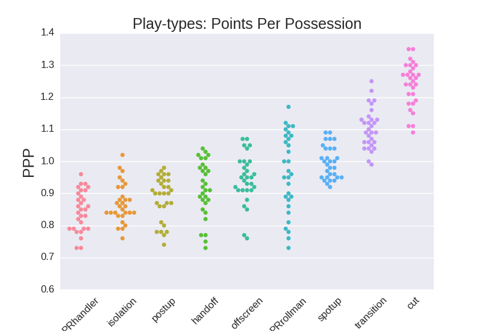
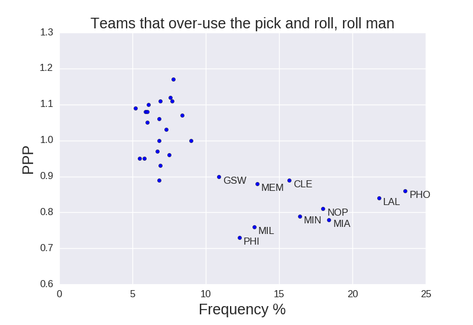
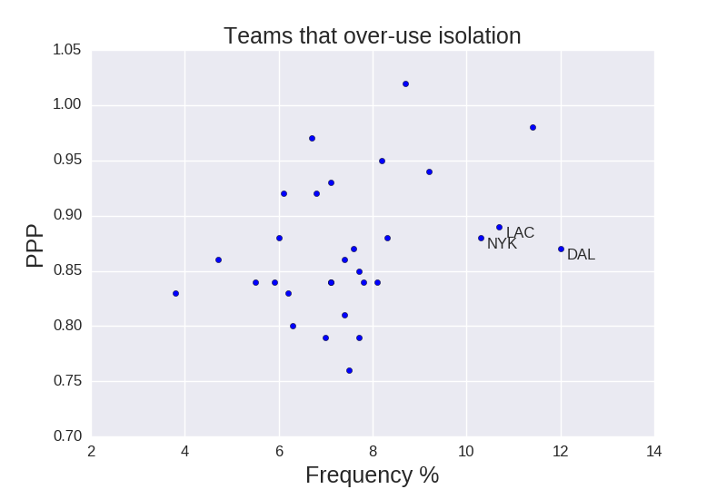
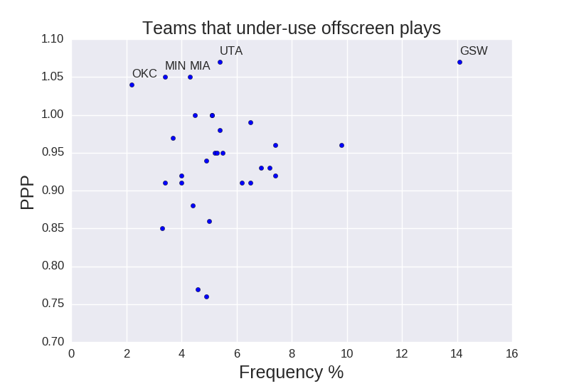
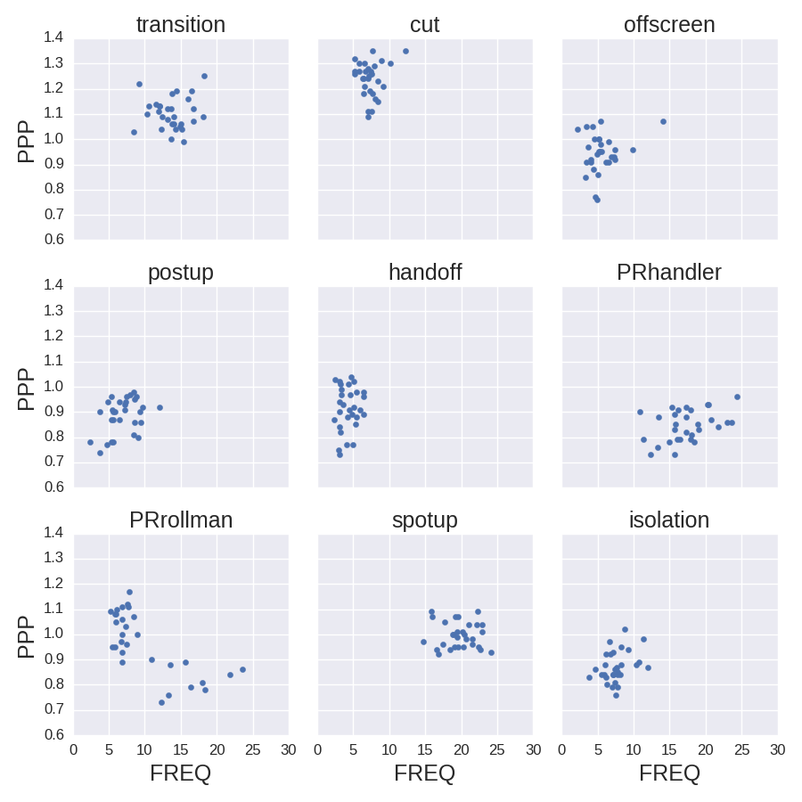
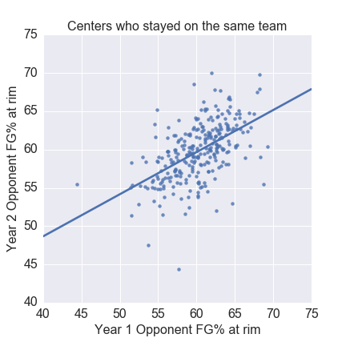
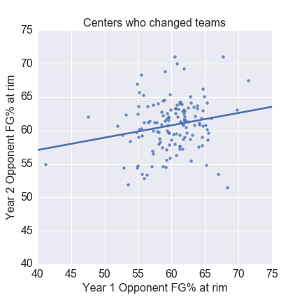

# NBA-analytics
Short, offhand analyses of the NBA

Note: All stats are from stats.nba.com

## Topics Covered 
* Underrated Assisters
* Which teams run the wrong plays?
* Shot Clock Analysis
* Westbrook Rebounding
* Rim Protection
* Tanking
* Emperical Bayes estimation of NBA statistics
* James-Stein estimation of NBA statistics
* Player Efficiency Rating (PER)
* Referee Analysis

## Underrated Assisters (December 2016)

I wanted to look into underrated assisters in the NBA.  Players who are really good at creating plays by passing, but don't necessarily rake up traditional "Assists" in their box score.  I thought I would find players who are thought to be bad/average, but are actually elite.  What I ended up finding is that a few elite players are even more elite than we think.

First, are there players who don't get a ton of traditional assists, but get a lots of "Secondary Assists"?  The guy who passes it to the assister.  The hockey assist.  The answer is **Steph Curry**.  Below, I'm plotting the total primary and secondary assists of every player in the NBA this season.

In fact, the **Warriors** are a standout team when it comes to total hockey assists. It's not even close.

Another thing I wanted to look at was if there are players whos assists are more valuable than other players.  If a player assists a lot of 3PT shots, that is more valuable than a lot of 2PT assists.  Again, it turns out that two all-stars, **LeBron James** and **James Harden** are at the top of this list.  My favorite anomaly in this category is **Harrison Barnes** who has 34 3PT Assists and 3 2PT Assists.  He exclusively assists to 3PT shooters.  

Finally, I thought I could find underrated assisters by looking at "Potential Assists".  A Potential Assist is a pass that leads to a shot, even if the shot does not go in.  I thougt this could be used to find players who are good as passing, but they are on bad teams and the shooter never makes the shot.  I turned out to be wrong: All players in the NBA essentiall have a 2:1 ratio of potential assists to assists.  

## Which teams run the wrong plays? (February 2017)

Intuition says certain play-types are not as efficient as others (for example, post-ups probably aren't very efficient).  Here we break down each play-type in the NBA and analyze each play type's efficiency (points per possession, PPP).

First, **How efficient is each play?**  For this whole analysis, we are using points per possession (PPP) as the measure of efficiency.  Below we are plotting each teams PPP for each play type. What we see matches canonical intuition: Cutting to the basket and plays in transition are very efficient.  Isolation plays and pos-ups are not efficient.  Somewhat surprisingly, Pick and Rolls where the ball handler finishes is not an efficient play (regardless of team).

I thought this could be used to identify teams that are running too many inefficient plays or teams that are not running enough efficient plays.  

For example, are there teams that run too many pick and rolls with the roll man finishing?  There are ten teams that stand out as teams that run a high percentage of pick and rolls while being very inefficient at it:

What about isolation plays (a classically inefficient play)? **Mavericks, Knicks, and Clippers** stand out as teams that over-utilize isolation plays for how effective they are. (I would argue all teams over-utilize isolation plays, but these are the stand-out teams).

Are there teams that under-utilize certain plays?  Teams that are very effective at a certain play type, but hardly use it? **The Thunder, Timberwolves, Heat, and Jazz** are all very effective at plays coming off screens, but they hardly use it.  Perhaps they should try to utilize this more often.  The Warriors are an example of a team that uses off-screen plays a lot, while being efficient at it.

Below, I'm plotting the distribution of all play-types points per possession and frequency (for each team). This is an overly busy graph, but it is nice to see the distribution of teams.  Also, if you want to dig into the actual numbers, the code can be found in `analysis/play-type-ppp/playPPP.py`

## Shot Clock Analysis (January 2017)

Casually watching the NBA, you notice that as the shot clock wears down, teams settle for worse shots.  Here we analyze why this happens.

First, do teams actually take worse shots when the shot clock winds down?  If we look at eFG% for all shots taken this season binned by time left on the shot clock, we see that teams take much worse shots when the shot clock is near 0.  **eFG% drops by over 10% late in the shot clock.**

Why is this the case?  When we break down what shots players are taking, we see that late in the shot clock players take more mid range shots (a low eFG% shot).  This is at the expense of shots in the restricted area.  Interestingly, 3PT shots are relatively unaffected by the shotclock.  To summarize: **as the shot clock winds down, players shift from taking shots in the restricted area to the mid range.**

I thought it would be interesting to look at teams that are unaffeted by the shotclock.  What I found was that nearly every team drops in eFG% as the shot clock runs down.  However, **The Spurs** and **The Bucks** maintain their eFG% as the shot runs down.  Below, I am plotting two teams eFG% side by side.  You see that Portland is affected by the shot clock (like most teams), while Milwaukee is relatively unaffected.

## Westbrook Rebounding (January 2017)

As of today, Russell Westbrook is averaging a triple double:
* 30.8 PTS
* 10.5 AST
* **10.7 REB**

How did he add 3 extra rebounds per game to his stat line?  He's just soaking up uncontested rebounds.

When we look at uncontested rebounds, Westbrook is a clear outlier.  When we look at the rest of OKC, it appears he's taking uncontested rebounds from Adams and Kanter to pad his stats.

Uncontested rebounds is a useless stat that pads your "Rebounds" in the box score.  Using the linear relation in the plot above, we can correct each players rebounds stats.  For example, **Russle Westbrook gets 8.3 uncontested rebounds a game**, but given he rebounding ability (contested rebounds per game), we can estimate that **he should only get 3.7 uncontested rebounds a game**. Using this correction, we see can now look at how many total rebounds players on OKC should get:

* **Russle Westbrook should get 5.8 rebounds per game** (instead of 10.7)
* **Enis Kanter should get 8.3 rebounds per game** (instead of 6.6)
* **Steven Adams should get 9.4 rebounds per game** (instead of 7.6)

## Rim Protection (January 2017)

The idea for this analysis came through discussions with [Justin Palmer](https://github.com/Caged)

There is lots of talk that Portland Trail Blazers currently need a rim protector.  But with Dame and CJ being such poor perimeter defenders (letting everyone past them), could a good rim protector pick up the slack?  At the heart of the question, is a good rim protector a product of their team?  Or is rim protection an individual skill?

Here, we addressed this question by comparing centers that stayed on the same team for two consecutive years and rim protectors that changed teams.  The statistic used to quantify rim protection is opponent FG% at the rim.

What we see is when a center stays on the same team, their rim protecting abilities is consistent from one year to the next (r=0.54).  [This has been previously documented](http://fansided.com/2017/01/12/nylon-calculus-shot-defense-metrics-actions/). 

Interestingly though, when a center changes teams, his rim protecting ability is essentially uncorrelated with his previous year's ability (r=0.20).  This dichotomy indicates that the team defensive system plays a large part of how well a center can defend the rim.

Perhaps Festus (when healthy) may not be able to solve the Blazers's problems.

## Tanking (December 2016)
If an NBA team "tanks" and gets a poor record, they are more likely to get the first pick in the following draft.  But how does the first pick change the course of a franchise?  Here we analyze the ten year trajectory of all teams since 1990 that obtained the first draft pick.

How does a team's win percentage change after getting the top pick?  Teams peak 4 years after getting the first pick, and their regular season win percentage goes up by 30% on average.  That is 25 extra regular season wins!

What about making the playoffs?  Again, teams peak four years after tanking.  The results are striking though.  Nearly 70% of teams made the playoffs 4 years after tanking.  The percentage of tanking teams making the playoffs stays above 50% for years 4-9 after tanking.  

## Emperical Bayes estimation of NBA statistics (January 2017)
There is a very common problem after the first month of the NBA season.  How do you estimate someone's ability to shoot 3PT shots after they have taken there first 10 3PT attempts?  Maybe they only made 1, or maybe they made 9.  Either way, it seems unreasonable to use their current 3PT% as your best guess for what their 3PT% will be for the remainder of the season.

Previously, we looked at James-Stein estimation of NBA statistics to solve this problem (see below).  Here, we use a method called Emperial Bayes.

So far into the season, how are players distributed when it comes to 3PT%?  

In Emperican Bayes, we fit a beta distribution to the emperical distribution and use this as our prior prediction for players probability.  What this means is that our starting point for estimating a players 3PT% is to just ask "Well, how do most players in the NBA shoot 3PT shots?"

Using this as our starting point, we use each player's 3 point attempts and 3 point made shots as evidence to update our prior belief.  This means if a player has made a ton of 3PT shots, we update our estimate of their 3PT% to reflect that.  

In essence, Emperical Bayes accounts for small sample sizes by dialing each players 3PT% towards the league average.  Just like James-Stein estimation, the less shots they've taken, the closer to league average they are estimated.  If you've made 9 out of 10 shots from 3PT, that will likely not keep up for the rest of the season and your Emperical Bayes 3PT% estimate will reflect that.

As you can see, most players are dialed toward the league average.

Here are some interesting results for players's Emperical Bayes 3PT% estimate:

* Even though **James Jones** has the highest 3PT% (51%), he has only taken 28 3's, so his emperical bayes estimate is only 43%.
* **George Hill** has the highest 3PT% Estimate (44%)
* The other players in the top 5 are **Kyle Lowry, Danny Green, and JJ Redick**

Emperical Bayes can do more than estimate your 3PT%.  It can also provide credible intervals (similar to confidence intervals).  For example, George Hill's 3PT% estimate is 43%, but his 95% credible interval spans from 36%-52%.  As the season goes on and he takes more 3s, the credible interval will get tighter and tighter.

## James-Stein estimation of NBA statistics (November 2016)
There is a very common problem after the first month of the NBA season.  How do you estimate someone's ability to shoot 3PT shots after they have taken there first 10 3PT attempts?  Maybe they only made 1, or maybe they made 9.  Either way, it seems unreasonable to use their current 3PT% as your best guess for what their 3PT% will be for the remainder of the season.

In fact, commentators frequently say things like, "He's currently shooting 55% from 3, but that should regress to the mean".  They don't really know what they are talking about, but there intuition is certainly correct.  The idea is that if a shooter begins shooting an extreme percentage, he is more likely to end up about average than maintain the extreme shooting for the rest of the seaon.

This is what James-Stein estimation tries to accomplish.  In frequentist statistics (Maximum likelihood estimation), you would assume every shooter's true 3PT% is whatever he is currently shooting.  However, James-Stein estimation says, actually, we need to dial it towards the league average.  Importantly, the extent to which we dial it back to the league average depends on how far from the mean the player is shooting and also how many shots the player has taken.  

So if a player is shooting 35% from 3 after taking 300 shots, James-Stein estimation will say he's probably about a 35% 3PT shooter.  On the other hand if a player is shooting 80% from 3, but has only taken 5 shots, James-Stein estimation will more say that players true 3PT% is much less than 80%.

In PER/PER.py we calculate the James-Stein estimated 3PT% for each player in the NBA using their 3PT shot data so far this season.  Details of the calculation can be found in:

Efron, Bradley, and Carl N. Morris. Stein's paradox in statistics. WH Freeman, 1977.

James-stein estimation is given by:

where **y** is a vector of player's current 3PT% and the number of players m.  Notice how **y** is shrunk towards the origin.

Here we have plotted the players emperical 3PT% (blue) and James-Stein 3PT% estimation (green).  As you can see, the extremes are dialed in towards the league average.

It also helps to look at individual cases.  J.J. Redick is a great 3PT shooter.  So far he is shooting 49%, making 34/69 shots.  Since he has taken a healthy amount of shots, James-Stein estimation only dials him back to 43%.  On the other hand, Serge Ibaka is also making nearly 49%, but only on 38 attempts.  James-Stein dials his 3PT% estimation all the way down to 37%.

Here are some interesting estimates of 3PT%:

## Player Efficiency Rating (PER) (November 2016)
Player efficiency rating (PER) is a linear combination of box score statistics which is commonly used as a single number to describe how valuable a player is.  Here, we look at a number of properties of PER (from the 2015-16 season).

PER is normalized so that the league average for a given season is 15.  But what is the actual distribution of PER?

What we see is that the distribution of PER isn't actually centered around 15.  The fact that the mean is 15 is due to players with extremely high PERs bring up the average.  Instead, **the bulk of players are centered around 12-14**.  In fact, the distribution is quite tight, with a **standard deviation of ~4**. 

With PER, we can see when players peak during their career:

For the high-end talent, players peak in their late 20's and begin a fairly linear decline.

One common critism of PER is that Offense is heavily favored.  When we break down by position, we see that Point Gaurds and Centers are favorite.  This is due to PER weighting things like assists and rebounds heavily, which are biased towards those positions.

Lastly, one might expect to use players with higher PERs more than players with low PERs (not a very complicated hypothesis).  Indeed, this seems to be true, with a linear correlation between usage and PER.

What is interesting though, is which players are underused or overused according to their PER.

**DeMarcus Cousins**, while being a great player, was far over-used according to his PER.  This is likely due to him being on a disfunctional team.  **Kobe** was obviously the most used player in the NBA (by this metric, but also by the eye test).  Everything was running though him and he was not very good.

Alternatively, **Boban** and **Whiteside** were underused. I attibute this to their inexperience and coaches not yet trusting them enough to run plays for.

Interestingly, The warriors perfectly used Steph Curry.  This seems like a difficult task given how many talents they are working with.

If anyone is interested, here are the top and bottom PERs from last season:

and all time:

## Referee Analysis (November 2016)

Refereeing in the NBA is an extremely hard job.  While all of the referees are professionals, they have different inclinations to blow there whistle. Here we analyze how many fouls were awarded by referees during the 2015-16 NBA season. Note: All data is normalized "per game".

When we look at the total free throws awarded for home and away teams, we see that 3 referees cluster away from the rest of the refs.  They slow down the game dramatically by awarding more FTA per game.  Refs are commonly accused of causing home-team advantage.  On the bright side, these 3 whistle-blowers don't seem to contribute to home-team advantage.

Who are these refs?

* **Ken Maur**
* **Josh Tiven**
* **Zach Zarba**

When we combine all FTA awarded per game (home and away), it is immediately clear that these three refs are not like the rest of the reffing team in the NBA.

What about personal fouls?  Are there refs that like to call a ton of personal fouls?

In fact, a single ref calls much more personal fouls then the other refs.  Who is it? **Zach Zarba**

So what about the other two refs that like to call a lot of shooting fouls?  When we break down each ref by how many personal fouls they call and how many shooting fouls they call, we see a linear correlation.  This makes sense: refs have a certain amount of 'trigger-happiness' and they don't discriminate by which type of fouls they are calling.  **Ken Maur** and **Josh Tiven**, on the other hand, like to call a high proportion of shooting fouls relative to personal fouls.  What does that mean?  I have no idea.

